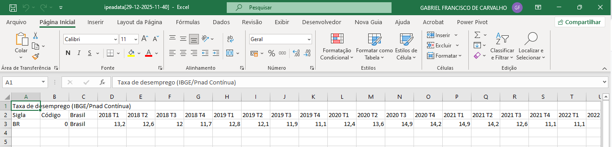

# 📊 01 - Dados Brutos (Raw Data)

## 📌 Objetivo
Armazenar os dados originais do IBGE antes de qualquer processamento.

## 📁 Conteúdo
- Dados brutos do IBGE utilizados como fonte para o processo de ETL.
- Metadados das variáveis
- Documentação da fonte

## 📸 Evidências Visuais do Processo

### 1. Fonte dos Dados - Site do IBGE

*Captura da página do IBGE mostrando onde os dados foram obtidos*

### 2. Dados Originais no Excel/CSV

*Visualização dos dados brutos antes de qualquer tratamento*

## 📊 Metadados da Fonte
**Fonte:** IBGE - PNAD Contínua  
**Período:** 2020-2025  
**Variáveis:** Taxa de desemprego brasil 2020 a 2025  
**Frequência:** Trimestral  
**Link oficial:** [https://www.ibge.gov.br/](https://www.ibge.gov.br/)

## ⚠️ Observações
- Dados mantidos no formato original
- Nenhuma transformação aplicada
- Preservação da integridade da fonte

## 🔗 Links Úteis
- [IBGE - PNAD Contínua](https://www.ibge.gov.br/estatisticas/sociais/trabalho/9171-pesquisa-nacional-por-amostra-de-domicilios-continua-mensal.html)
