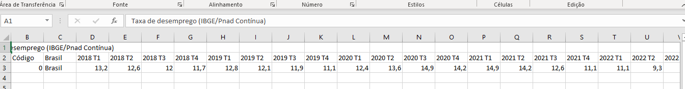
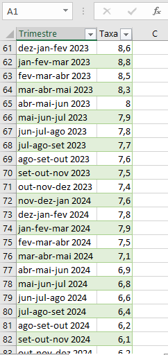

# 📊 02 - Área de Staging

## 📌 Objetivo
Preparar e transformar os dados brutos do IBGE do formato horizontal (92 colunas) para formato vertical/tidy (92 linhas), adequando-os para o processo de ETL automatizado.

## 🔧 Processo Realizado
1. **Importação**: Dados do CSV transformado para tabela SQL
2. **Transformação**: Transposição de colunas para linhas (92 colunas horizontais → 92 linhas verticais)
3. **Limpeza**: Conversão de formatos e tratamento de valores
4. **Validação**: Comparação ponto a ponto com data warehouse
5. **Padronização**: Formatação de trimestres e valores decimais

## 📊 Estrutura dos Dados Após Staging
Os dados agora estão no formato "tidy data" (dados organizados), ideal para análise:

| trimestre            | taxa_desemprego | data_carga          |
|----------------------|-----------------|---------------------|
| "dez-jan-fev 2023"   | 8.6             | 2025-01-28 10:30:00 |
| "jan-fev-mar 2023"   | 8.8             | 2025-01-28 10:30:00 |
| "fev-mar-abr 2023"   | 8.5             | 2025-01-28 10:30:00 |
| ...                  | ...             | ...                 |
| "ago-set-out 2025"   | 5.4             | 2025-01-28 10:30:00 |

**Total:** 92 trimestres (2018-2025)

## 🖼️ Evidências Visuais do Processo

### 1. Dados Originais no Excel

*Dados originais do IBGE em formato horizontal (92 colunas) antes da transformação*

### 2. Dados Transformados

*Dados convertidos para formato vertical (tidy) após transposição no Excel - 92 linhas × 2 colunas*

### 3. Validação dos Dados

*Comparação e validação dos dados entre staging e data warehouse (92 trimestres)*

## ⚙️ Tecnologias Utilizadas
- **Microsoft Excel**: Para transposição manual dos dados
- **SQL Server**: Para armazenamento e validação
- **T-SQL**: Linguagem de transformação e consulta
- **SQL Server Management Studio**: Interface de gerenciamento

## 📝 Notas Técnicas
- Transformação manual realizada com "Colar Especial → Transpor"
- Dados convertidos de 1 linha × 92 colunas para 92 linhas × 2 colunas
- Cada linha representa um trimestre móvel específico
- Valores convertidos para formato decimal (5,2)
- Validação completa de 92 registros realizada
- Comparação ponto a ponto com data warehouse

## 📋 Estrutura da Tabela Staging
```sql
CREATE TABLE STG_DESEMPREGO_IBGE (
    id_trimestre INT IDENTITY(1,1) PRIMARY KEY,
    trimestre_raw NVARCHAR(50) NOT NULL,
    taxa_raw NVARCHAR(20) NOT NULL,
    taxa_convertida DECIMAL(5,2) NULL,
    ano_extraido INT NULL,
    mes_inicial NVARCHAR(3) NULL,
    data_trimestre DATE NULL,
    data_carga DATETIME DEFAULT GETDATE(),
    flag_processado BIT DEFAULT 0
);

##📁 Arquivos Nesta Pasta
README.md - Esta documentação

dados_excel_brutos1.PNG - Print dos dados brutos no Excel

dados_trasformados.PNG - Print dos dados transformados

analise_92_linhas.PNG - Print da validação dos dados

dados_desemprego_staging.csv - Arquivo CSV com dados transformados (92 registros)

transformacao_excel.md - Tutorial do processo de transposição

##🔗 Fluxo de Dados
01_data_raw/ → Transformação Excel → 02_staging/ → Pronto para ETL (03_etl_ssis/)

##Status: ✅ Dados transformados e validados - Prontos para carga automatizada
