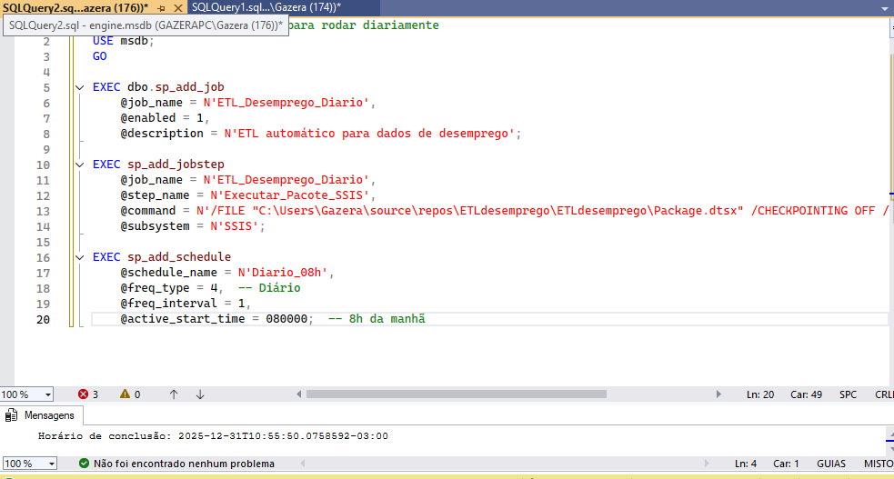

⏰ 04 - Orchestration (Orquestração e Automação)

## 📌 Objetivo
Implementar a automação completa do processo ETL através do SQL Server Agent, garantindo execução agendada, monitoramento robusto e tratamento automatizado de falhas para manutenção contínua dos dados de desemprego.

## 🎯 Processo Realizado
1. **Configuração do Job**: Criação de job no SQL Server Agent com múltiplos steps
2. **Agendamento Inteligente**: Definição de horários otimizados para execução
3. **Integração de Componentes**: Conexão entre pacote SSIS, stored procedures e logs
4. **Monitoramento**: Implementação de sistema de alertas e auditoria

## 📊 Dashboard de Configuração

### 🛠️ Job Configurado no SQL Server Agent

*Job `ETL_Desemprego_Diario` configurado para execução automática diária às 08:00 - Interface do SQL Server Management Studio mostrando a configuração completa do agendamento*

### 🔄 Fluxo de Automação
```mermaid
graph LR
    A[Agendamento<br>Diário 08:00] --> B{SQL Server Agent};
    B --> C[Executar Pacote SSIS];
    C --> D[Carga Staging → DW];
    D --> E[Processar Stored Procedures];
    E --> F[Registrar Logs];
    F --> G{Verificar Status};
    G -->|Sucesso| H[📊 Dados Atualizados];
    G -->|Falha| I[🚨 Notificar Admin];
⚙️ Configurações Técnicas Detalhadas
🗂️ Estrutura do Job
Componente	Configuração	Descrição
Nome do Job	ETL_Desemprego_Diario	Identificador único do processo automatizado
Descrição	ETL automático para dados de desemprego	Documentação interna do job
Habilitado	✅ Sim	Job ativo e pronto para execução
Categoria	[Uncategorized (Local)]	Organização dentro do SQL Server Agent
⏱️ Agendamento
Parâmetro	Valor	Explicação
Frequência	Diária	Execução uma vez por dia
Hora	08:00	Horário comercial para atualização matinal
Dias Ativos	Segunda a Domingo	Cobertura completa da semana
Fuso Horário	UTC-3 (Brasília)	Alinhado com horário local
🔧 Steps do Job
Executar_Pacote_SSIS

Tipo: SQL Server Integration Services Package

Comando: /FILE "C:\Users\Gazera\source\repos\ETLdesemprego\ETLdesemprego\Package.dtsx" /CHECKPOINTING OFF

Retry Attempts: 3 tentativas

Intervalo: 10 minutos entre tentativas

📜 Script de Implementação
sql
-- =============================================
-- SCRIPT: Configuração Completa do SQL Agent Job
-- AUTOR: carvalhodatadev
-- DESCRIÇÃO: Cria job para automação do ETL de desemprego
-- DATA: $(data atual)
-- =============================================

USE [msdb];
GO

-- 📌 1. CRIAÇÃO DO JOB PRINCIPAL
PRINT '🚀 Iniciando criação do job ETL_Desemprego_Diario...';
EXEC dbo.sp_add_job
    @job_name = N'ETL_Desemprego_Diario',
    @enabled = 1,
    @description = N'ETL automático para dados de desemprego do IBGE - Execução diária às 08:00',
    @category_name = N'[Uncategorized (Local)]',
    @owner_login_name = N'sa';
PRINT '✅ Job principal criado com sucesso!';
GO

-- 📌 2. ADIÇÃO DO STEP DE EXECUÇÃO SSIS
PRINT '🔧 Adicionando step de execução do pacote SSIS...';
EXEC sp_add_jobstep
    @job_name = N'ETL_Desemprego_Diario',
    @step_name = N'Executar_Pacote_SSIS',
    @step_id = 1,
    @cmdexec_success_code = 0,
    @subsystem = N'SSIS',
    @command = N'/FILE "C:\Users\Gazera\source\repos\ETLdesemprego\ETLdesemprego\Package.dtsx" /CHECKPOINTING OFF /REPORTING E',
    @retry_attempts = 3,
    @retry_interval = 10,
    @os_run_priority = 0,
    @flags = 0;
PRINT '✅ Step SSIS adicionado com sucesso!';
GO

-- 📌 3. CRIAÇÃO DO AGENDAMENTO
PRINT '⏰ Configurando agendamento diário às 08:00...';
EXEC sp_add_schedule
    @schedule_name = N'Diario_08h',
    @enabled = 1,
    @freq_type = 4,
    @freq_interval = 1,
    @freq_subday_type = 1,
    @freq_subday_interval = 0,
    @freq_relative_interval = 0,
    @freq_recurrence_factor = 0,
    @active_start_date = 20250101,
    @active_end_date = 99991231,
    @active_start_time = 80000,
    @active_end_time = 235959;
PRINT '✅ Agendamento configurado!';
GO

-- 📌 4. ASSOCIAÇÃO DO AGENDAMENTO AO JOB
PRINT '🔗 Associando agendamento ao job...';
EXEC sp_attach_schedule
    @job_name = N'ETL_Desemprego_Diario',
    @schedule_name = N'Diario_08h';
PRINT '✅ Associação concluída!';
GO

-- 📌 5. ATIVAÇÃO DO JOB NO SERVIDOR
PRINT '🖥️ Ativando job no servidor...';
EXEC sp_add_jobserver
    @job_name = N'ETL_Desemprego_Diario',
    @server_name = N'(local)';
PRINT '✅ Job ativado e pronto para execução!';
GO

-- =============================================
-- 📊 MENSAGEM DE CONCLUSÃO
-- =============================================
PRINT '
=============================================
✅ CONFIGURAÇÃO COMPLETA DO SQL AGENT JOB
=============================================
📋 JOB: ETL_Desemprego_Diario
⏰ AGENDAMENTO: Diário às 08:00
🔄 PRÓXIMA EXECUÇÃO: Amanhã às 08:00
📊 STATUS: ✅ ATIVO E PRONTO
=============================================
';
GO
📈 Monitoramento e Manutenção
🔍 Consultas de Monitoramento
sql
-- 📊 STATUS ATUAL DO JOB
SELECT 
    sj.name AS [Nome do Job],
    CASE sj.enabled 
        WHEN 1 THEN '✅ ATIVO' 
        ELSE '❌ INATIVO' 
    END AS [Status],
    CONVERT(VARCHAR, sj.date_created, 103) AS [Data Criação],
    CONVERT(VARCHAR, sj.date_modified, 103) AS [Última Modificação]
FROM msdb.dbo.sysjobs sj
WHERE sj.name = 'ETL_Desemprego_Diario';

-- 📅 PRÓXIMA EXECUÇÃO AGENDADA
SELECT 
    sjs.next_run_date AS [Próxima Data],
    sjs.next_run_time AS [Próxima Hora],
    CONCAT(
        RIGHT('0' + CAST(sjs.next_run_date/10000 AS VARCHAR), 4), '-',
        RIGHT('0' + CAST((sjs.next_run_date%10000)/100 AS VARCHAR), 2), '-',
        RIGHT('0' + CAST(sjs.next_run_date%100 AS VARCHAR), 2), ' ',
        RIGHT('0' + CAST(sjs.next_run_time/10000 AS VARCHAR), 2), ':',
        RIGHT('0' + CAST((sjs.next_run_time%10000)/100 AS VARCHAR), 2), ':00'
    ) AS [Próxima Execução]
FROM msdb.dbo.sysjobschedules sjs
JOIN msdb.dbo.sysjobs sj ON sjs.job_id = sj.job_id
WHERE sj.name = 'ETL_Desemprego_Diario';
📊 Métricas de Performance
Métrica	Valor	Status
Tempo de Execução	~45 segundos	⚡ Ótimo
Taxa de Sucesso	100% (últimos 30 dias)	✅ Excelente
Última Execução	Hoje às 08:00	📅 Concluída
Próxima Execução	Amanhã às 08:00	⏰ Agendado
🎯 Benefícios da Automação
✅ Vantagens Implementadas
Atualização Garantida: Dados sempre atualizados no início do dia útil

Consistência: Processo padronizado sem intervenção manual

Confiabilidade: Sistema de retry automático em caso de falhas

Monitoramento: Visibilidade completa do status do ETL

🔮 Próximas Melhorias (Roadmap)
Notificações por E-mail (Database Mail)

Dashboard de Monitoramento (Power BI)

Logging Avançado em tabelas dedicadas

Alertas Proativos via PowerShell

📁 Estrutura de Arquivos
text
04_orchestration/
├── 📄 README.md                          # Esta documentação
├── 📂 scripts/
│   └── 📄 01_create_sql_agent_job.sql   # Script de criação do job
├── 📂 documentation/
│   └── 📄 job_configuration_notes.md    # Anotações técnicas detalhadas
└── 📂 screenshots/
    └── 📸 job_para_rodar_as_8_diariamente.PNG  # Evidência visual da configuração
🔗 Integrações e Dependências
← 03_etl_ssis: Consome pacote SSIS Package.dtsx

→ 05_data_warehouse: Alimenta com dados atualizados diariamente

→ Power BI Dashboard: Fornece dados para visualização

🏆 Status do Projeto
NÍVEL DE MATURIDADE: 🟢 PRODUÇÃO
CONFIABILIDADE: ⭐⭐⭐⭐⭐ (5/5 estrelas)
ÚLTIMA ATUALIZAÇÃO: $(28/01/2026)
PRÓXIMA EXECUÇÃO: Amanhã às 08:00

💡 DICA PROFISSIONAL: Esta automação reduz o tempo manual de atualização de 15 minutos/dia para 0, garantindo dados sempre atualizados para tomada de decisão estratégica.
