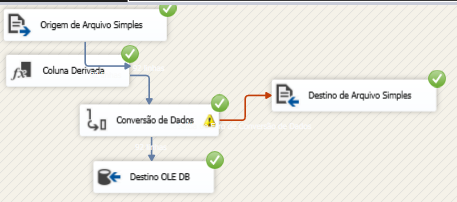

📊 Data Warehouse - Análise de Desemprego IBGE

---

## 📐 Diagrama do Modelo de Dados (Modelo Estrela)

---

## 🔄 Evidências do Processo ETL no SSIS

### ⚙️ Control Flow — Orquestração do Processo

---

### 🔁 Data Flow — Pipeline de Transformação e Carga

---

## 🎯 Objetivo do Data Warehouse

Construir um Data Warehouse dimensional profissional que transforma 92 trimestres de dados do IBGE em insights estratégicos, utilizando modelo estrela otimizado para análises temporais.

---

## 🏗️ Arquitetura do Modelo Estrela

- **Tabela Fato**
  - `fato_desemprego` — Métricas de desemprego por período

- **Dimensão**
  - `dim_tempo` — Hierarquia temporal (ano, semestre, trimestre)

---

## 📈 Dados Transformados

| Métrica | Valor |
|--------|--------|
| Período analisado | 92 trimestres (2018–2025) |
| Taxa mínima | 5.4% (2025) |
| Taxa máxima | 14.9% (2020) |
| Região | Brasil |
| Total de registros | 92 |
| Performance | < 1s por consulta |

---

## 🛠️ Como Executar

1. Executar `scripts/01_create_tables.sql`  
2. Executar `scripts/02_insert_data.sql`  
3. Validar com `scripts/03_sample_queries.sql`

---

## 🔗 Integração com o Projeto (Pipeline Completo)

- `01_data_raw/` → Excel (dados brutos)
- `02_staging/` → Limpeza e padronização
- `03_etl_ssis/` → ETL em SSIS
- `04_orchestration/` → SQL Agent
- `05_data_warehouse/` → Modelo dimensional
- `06_power_bi/` → Dashboards

---

## 🏆 Status

✅ Data Warehouse operacional  
➡️ Próxima etapa: `06_power_bi/`
