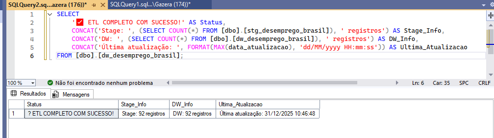
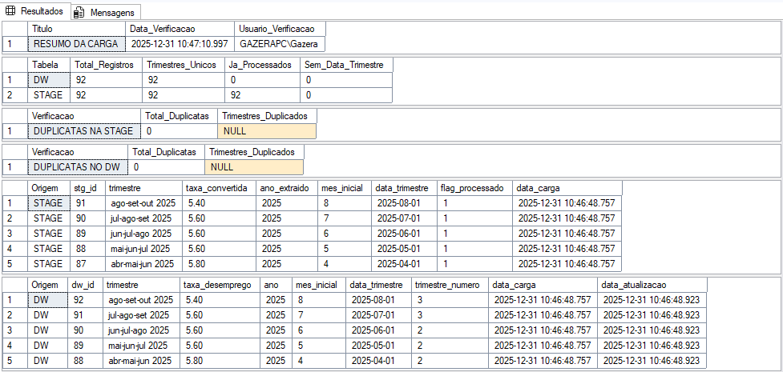
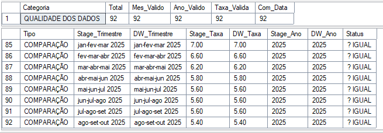

✅ Data Quality — Validação e Confiabilidade dos Dados

📁 Arquivos Nesta Pasta

README.md — Esta documentação

📂 scripts/
01_data_validation.sql — Scripts de validação e consistência dos dados

📂 documentation/
data_quality_checks.md — Regras e critérios de qualidade aplicados

📂 screenshots/
01_success_confirmation.PNG — Confirmação de carga bem-sucedida
02_success_confirmation.PNG — Logs de sucesso do processo ETL
03_analise_92_linhas.PNG — Validação da quantidade esperada de registros

---

🎯 OBJETIVO DA ETAPA DE DATA QUALITY

Garantir que os dados carregados no Data Warehouse estejam completos, consistentes e dentro de regras aceitáveis de negócio antes de serem consumidos pelo Power BI.

Esta etapa reduz riscos de:

- Indicadores incorretos
- Análises distorcidas
- Decisões baseadas em dados inválidos

---

📸 EVIDÊNCIAS DE QUALIDADE DOS DADOS

🟢 Confirmação de Execução Bem-Sucedida

---

🧾 Logs de Processamento do ETL

---

📊 Validação de Volume de Dados (92 Trimestres)

---

🧪 TIPOS DE VALIDAÇÕES REALIZADAS

As verificações de qualidade incluem:

- Valores nulos em chaves primárias e estrangeiras
- Faixa válida da taxa de desemprego (0% a 100%)
- Quantidade esperada de registros por período
- Integridade entre fato e dimensões
- Detecção de duplicidades

---

⚙️ VALIDAÇÕES NO BANCO DE DADOS

As validações são executadas via SQL Server, diretamente no Data Warehouse, utilizando:

- Consultas de verificação
- Constraints de integridade
- Controles de auditoria no ETL

Essas validações podem ser integradas automaticamente ao pipeline.

---

📊 EXEMPLOS DE CONTROLES APLICADOS

- Contagem total de registros após carga
- Verificação de períodos faltantes
- Comparação com volume esperado (92 trimestres)
- Registro de status em tabelas de controle

---

🔗 INTEGRAÇÃO COM O PIPELINE

Fluxo do projeto:

1. Staging Area
2. ETL via SSIS
3. Data Quality Checks ✅
4. Data Warehouse
5. Power BI

Somente após aprovação nas validações os dados seguem para análise.

---

🏆 BENEFÍCIOS DA CAMADA DE DATA QUALITY

- Maior confiabilidade dos KPIs
- Detecção precoce de falhas de carga
- Facilidade de auditoria
- Padronização de regras de negócio

---

🔗 PRÓXIMA ETAPA

07_power_bi/ → Visualização e Análise de Dados

---

Status: ✅ DADOS VALIDADOS E APROVADOS PARA CONSUMO ANALÍTICO
