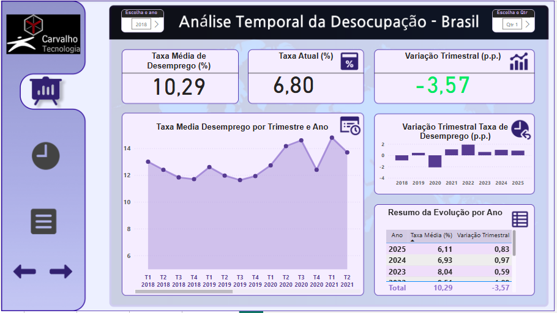
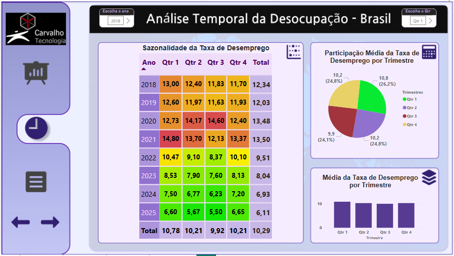
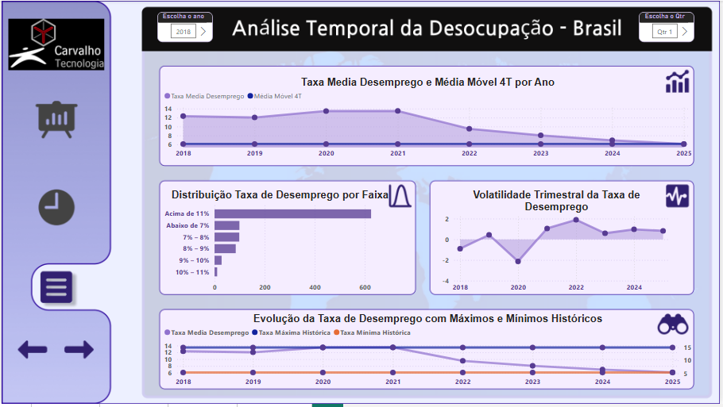
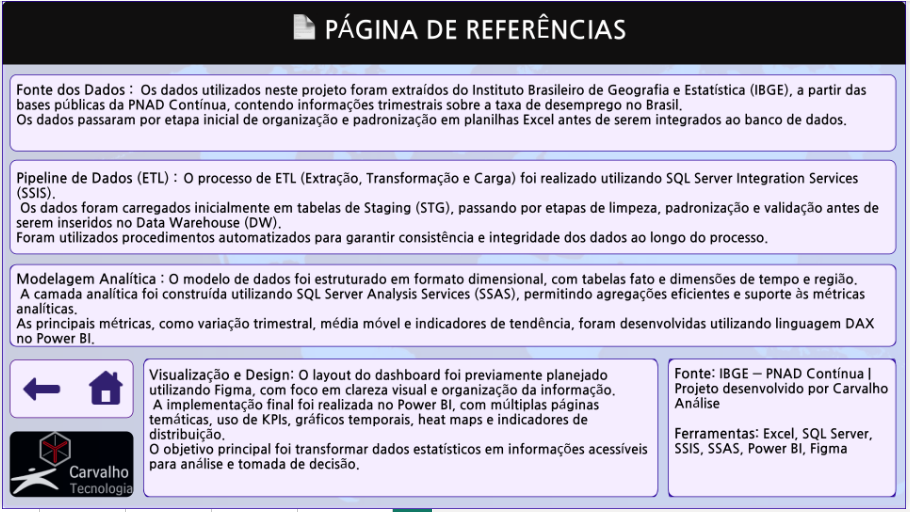

📊 Power BI — Dashboard Analítico de Desemprego (IBGE)

📁 Arquivos Nesta Pasta

README.md — Esta documentação

📂 dashboards/
dashboard_desemprego.pbix — Arquivo do relatório Power BI
documentation.md — Guia de navegação e leitura do dashboard

📂 data_models/
star_schema_diagram.md — Diagrama e explicação do modelo estrela
dax_measures.md — Medidas DAX utilizadas no relatório

📂 documentation/
power_bi_setup.md — Configuração técnica e conexão com o Data Warehouse

📂 screenshots/
01_capa_dashboard.PNG — Capa visual do dashboard (design Figma)
02_pagina_analise_1.PNG — Página de análises temporais (visão 1)
03_pagina_analise_2.PNG — Página de análises temporais (visão 2)
04_pagina_analise_3.PNG — Página de análises temporais (visão 3)
05_pagina_referencias.PNG — Página de fontes e metodologia

---

🎯 OBJETIVO DO DASHBOARD

Fornecer uma análise visual, interativa e orientada a indicadores sobre a evolução do desemprego no Brasil, utilizando dados históricos do IBGE modelados em um Data Warehouse dimensional.

O dashboard permite:

- Análise temporal da taxa de desemprego
- Monitoramento de metas (KPI ≤ 8%)
- Identificação de tendências e sazonalidade
- Navegação entre períodos de forma interativa

---

📸 EVIDÊNCIAS VISUAIS DO DASHBOARD

🖼️ Capa do Dashboard (Design Visual)

---

📈 Página 1 — Análise Temporal (Visão Geral)

---

📉 Página 2 — Análise Temporal Detalhada

---

📊 Página 3 — Comparações e Tendências

---

📚 Página de Referências e Metodologia

---

🧠 MODELO DE DADOS UTILIZADO

O dashboard consome dados diretamente do Data Warehouse, utilizando modelo estrela:

Tabela Fato:
- fato_desemprego — Métrica de taxa de desemprego por trimestre

Dimensão:
- dim_tempo — Hierarquia temporal (Ano, Trimestre)

Relacionamento:
- dim_tempo (1) → fato_desemprego (*)

Esse modelo garante:

- Alto desempenho
- Simplicidade analítica
- Facilidade para criação de KPIs e tendências

---

📊 KPIs E ANÁLISES IMPLEMENTADAS

- Taxa Atual de Desemprego
- KPI de Meta (≤ 8%)
- Evolução Trimestral
- Tendência de Longo Prazo
- Análise Sazonal por Trimestre
- Comparação Ano a Ano

Todos os indicadores são calculados via medidas DAX.

---

⚙️ INTEGRAÇÃO COM O PIPELINE DE DADOS

Fluxo completo do projeto:

1. Dados brutos do IBGE (Excel)
2. Staging Area
3. ETL via SSIS
4. Data Warehouse (SQL Server)
5. Power BI (visualização analítica)

O Power BI consome apenas dados tratados e auditados no DW, garantindo:

- Confiabilidade
- Histórico consistente
- Governança dos dados

---

🏆 RESULTADOS ALCANÇADOS

- Dashboards interativos com resposta imediata
- KPIs com semáforo automático
- Visual moderno e profissional
- Base pronta para expansão futura (regiões, indicadores econômicos)

---

🔗 PRÓXIMA ETAPA DO PROJETO

07_documentation/ → Documentação corporativa final  
(Arquitetura, decisões técnicas e lições aprendidas)

---

Status: ✅ DASHBOARD POWER BI FINALIZADO E INTEGRADO AO DATA WAREHOUSE
